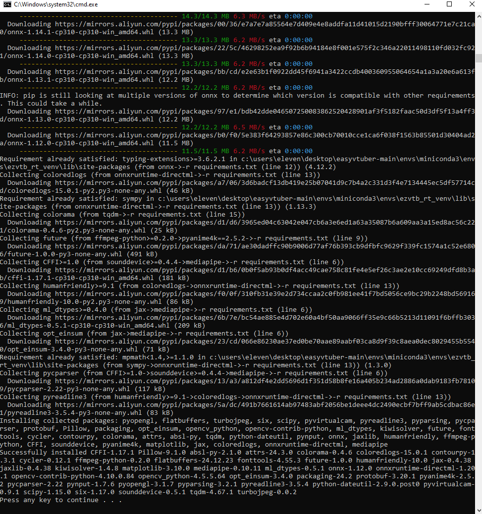
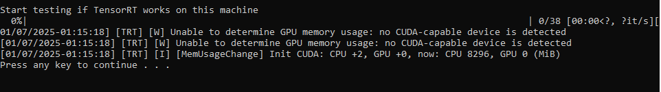
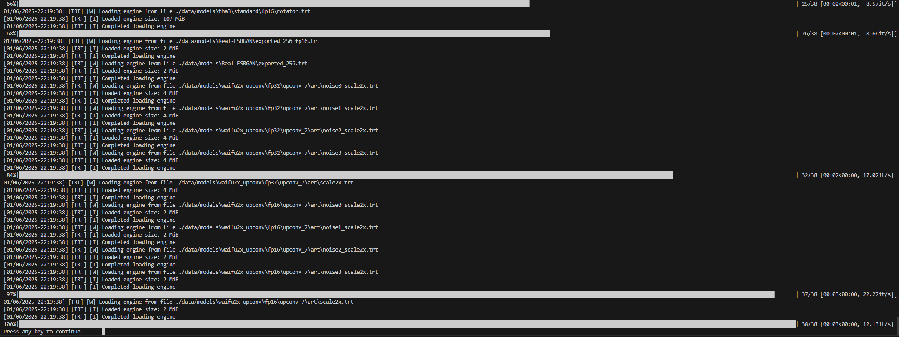

# EasyVtuber  

> 用买皮的钱，再买一张~~3080~~随便哪张显卡吧！


Fork自 https://github.com/GunwooHan/EasyVtuber  
为解决面捕质量问题，又反向port了原版demo https://github.com/pkhungurn/talking-head-anime-2-demo 中关于ifacialmocap的ios面捕逻辑  
并且省略了ifacialmocap pc端，通过UDP直连的方式使ios面捕刷新率达到最高60fps，解决了面捕刷新率的瓶颈  
最后，给EasyVtuber中使用的OBS虚拟摄像头方案增加配套的Shader支持，解锁RGBA输出能力，无需绿背即可直接使用

[视频介绍和安装说明](https://www.bilibili.com/video/BV1uu411r7DR)  

Updates:  
使用 https://github.com/zpeng11/ezvtuber-rt/tree/main 项目转换的ONNX模型，实现TensorRT加速以及非N卡支持，在半精度和全精度下均有加速（具体取决于显卡）  
为A卡和I卡提供DirectML支持，人人都能玩。  
引入RIFE模型进行插帧，极限帧数提升达到50%-100%，配合锁帧可以有效降低使用占用。  
使用TurboJPEG 获得成倍缓存命中率提升，在长时间使用上显卡减负效果相当出色。  
使用 waifu2x 和 real-esrgan 项目带来的输出超分辨率，对比anime4k效果提升显著（也使用更多gpu占用）

## Requirements  

### 硬件  

- 支持FaceID的iPhone（使用ifacialmocap软件，需购买，需要稳定的WIFI连接）或网络摄像头（使用OpenCV）  
- 任意5年内的游戏级显卡
### 软件

- 本方案在Windows 10上测试可用
- Python>=3.8
- OBS或Unity Capture（虚拟摄像头方案）
- Photoshop或其他图片处理软件
- 科学上网方案，看懂英文网站和报错的能力

## Installation(Release包版本)  
Release包版本带有本项目源码，ezvtuber-rt项目源码，和静态化模型。并且可以自动构建python环境。  
构建运行环境依赖anaconda，若本机未安装anaconda将自动下载miniconda并在`envs`文件夹内展开。

### 下载并安装CUDAToolkit
前往 [英伟达官网](https://developer.nvidia.com/cuda-downloads) 下载并安装`CUDATookit 12`及以上版本。

### 下载ZIP并解压  
点击[`Download ZIP`](../../releases/download/v0.1.0/EasyVtuber.zip) 下载并解压，源码和模型约3.5G。若在文件夹内展开miniconda和所有运行环境总计需要约20GB

### 构建运行环境
双击运行适合你的地域的`01A.构建运行环境（默认源）.bat`或者`01B.构建运行环境（国内源）.bat`  
这个脚本会使用anaconda安装所有需要的依赖  
两个脚本可以互相替代，并且支持从中断的位置继续  
如果出现网络相关报错，直接关掉控制台，调整网络，重新运行即可  
  
完全安装完成后再次运行脚本的输出如图所示。一般来说安装全程没有红字就是成功结束。  
如出现问题，请对照 [此log](assets/complete_building_log.txt) 为成功案例排查原因。  

### 检查模型并构建TensorRT
在安装并确认上一步没问题后可以点击`01C.检查模型并构建TensorRT加速  .bat`   
对英伟达用户这将会需要较长时间对模型进行TensorRT编译（>30min）。  
非英伟达显卡成功如图所示:  

英伟达显卡成功如图所示:  

否则都发生了错误，有三种可能
1. 上一步环境安装有错误（一般都是），一般检查源重新运行上一步即可,若反复错误则直接手动删除`envs`文件夹再重新运行上一步
2. nvcc没找到，等于未提前安装CudaTookit，请从头安装CudaTookit开始重新安装
3. 英伟达显卡但计算架构低于7.5（10系以及之前）不支持TensorRT

### 使用启动器测试结果
运行`02B启动器（调试输出）.bat`  
直接点击界面底部的`Save & Launch`
如果看到了弹出的opencv输出窗体，则安装成功完成


### 配置输入输出设备
在成功进行Debug输出之后，请移步之后的输入输出设备一节进行进一步配置以输出到OBS。


## Installation(科学上网且使用Git)  

### 安装Anaconda
这个项目使用Anaconda进行包管理  
首先前往https://www.anaconda.com/ 安装Anaconda  

### 克隆项目和子项目
```
git clone https://github.com/zpeng11/EasyVtuber.git
cd EasyVtuber
git submodule init
git submodule update --recursive --remote
```

### 使用脚本安装环境并下载模型
双击运行`01A.构建运行环境（默认源）.bat`或者`01B.构建运行环境（国内源）.bat`   
这两个脚本会构建名为`ezvtb_rt_venv`的conda环境  

### 下载模型
前往模型release 地址 https://github.com/zpeng11/ezvtuber-rt/releases/tag/0.0.1   
下载 https://github.com/zpeng11/ezvtuber-rt/releases/download/0.0.1/20241220.zip 并解压到`data/models`文件夹下

### 检查模型并构建TensorRT
点击`01C.检查模型并构建TensorRT加速  .bat`检查模型并构建TensorRT

### Pycharm 配置
安装完成后，在Pycharm内打开本项目，右下角解释器菜单点开，`Add Interpreter...`->`Conda Environment`->`Existing environment`  
选好自己电脑上的`conda.exe`和刚才创建好的`ezvtb_rt_venv`环境内的`python.exe`    
点击OK，依赖全亮即可  

### 运行启动器  
在Conda环境中执行以下命令  
`python launcher.py`  


## 输入输出设备  
#### SPOUT2 OBS插件输出
目前推荐这个方案，使用透明通道效果最好也最方便。使用前请移步 https://github.com/Off-World-Live/obs-spout2-plugin/releases  安装obs插件，并在obs中选择spout输入设备。

#### OBS Virtual Camera

目前更推荐这个方案，UnityCapture存在未查明的性能瓶颈  
如果你选择自己进行抠像你可以直接输出到obs，如果你需要RGBA支持则需要额外使用一个Shader  
下载并安装StreamFX https://github.com/Xaymar/obs-StreamFX  
下载Shader（感谢树根的协助） https://github.com/shugen002/shader/blob/master/merge%20alpha2.hlsl  
之后，使用`--alpha_split`参数运行
  
你会看到这样的输出画面，透明通道单独使用灰度方式发送了  
之后对OBS中的视频采集设备添加滤镜-着色器-选择你下载的`merge alpha2.hlsl`-关闭   
这样透明通道就应用回左边的图像了  
你可能需要手动调整一下裁剪把右侧的无用画面切掉  
(看不到着色器滤镜的话就是StreamFX没装好或者OBS不是最新版)

#### UnityCapture  

如果需要使用透明通道输出，参考 https://github.com/schellingb/UnityCapture#installation 安装好UnityCapture  
只需要正常走完Install.bat，在OBS里能看到对应的设备（Unity Video Capture）就行  

在OBS添加完摄像头以后，还需要手动配置一次摄像头属性才能支持ARGB    
右键属性-取消激活-分辨率类型自定义-分辨率512x512(与`--output_size`参数一致)-视频格式ARGB-激活

#### iFacialMocap  

https://www.ifacialmocap.com/download/  
你大概率需要购买正式版（非广告，只是试用版不太够时长）  
购买之前确认好自己的设备支持  
**不需要下载PC软件**，装好iOS端的软件即可，连接信息通过参数传入Python  

#### OpenSeeFace  

https://github.com/emilianavt/OpenSeeFace/releases  
直接下载最新版本的Release包并解压  
之后进入解压目录的Binary文件夹  
右键编辑`run.bat`，在倒数第二行运行facetracker的命令后加上`--model 4`，切换到模型4可以wink  
`facetracker -c %cameraNum% -F %fps% -D %dcaps% -v 3 -P 1 --discard-after 0 --scan-every 0 --no-3d-adapt 1 --max-feature-updates 900 --model 4`（仅供参考）  
之后保存并双击`run.bat`运行，按照提示选择摄像头、分辨率、帧率，捕获正常的话可以看到输出画面  
最后在启动器中选择OpenSeeFace输入，或添加启动参数`--osf 127.0.0.1:11573`即可接入OpenSeeFace

## Run

完全体运行命令`python main.py --output_webcam unitycapture --ifm 192.168.31.182:49983 --character test1L2 --extend_movement 1 --output_size 512x512`

参数名 | 值类型 | 说明
:---: | :---: | :---:
--character|字符串|`character`目录下的输入图像文件名，不需要带扩展名
--debug|无|打开OpenCV预览窗口输出渲染结果，如果没有任何输出配置，该参数默认生效
--input|字符串|不使用iOS面捕时，传入要使用的摄像头设备名称，默认为设备0，有ifm参数时无效
--ifm|字符串|使用iOS面捕时，传入设备的`IP:端口号`，如`192.168.31.182:49983`
--output_webcam|字符串|可用值为`obs` `unitycapture`，选择对应的输出种类，不传不输出到摄像头
--extend_movement|浮点数|使用iOS面捕返回的头部位置，对模型输出图像进一步进行移动和旋转使得上半身可动<br>传入的数值表示移动倍率（建议值为1）
--output_size|字符串|格式为`256x256`，必须是4的倍数。<br>增大它并不会让图像更清晰，但配合extend_movement会增大可动范围
