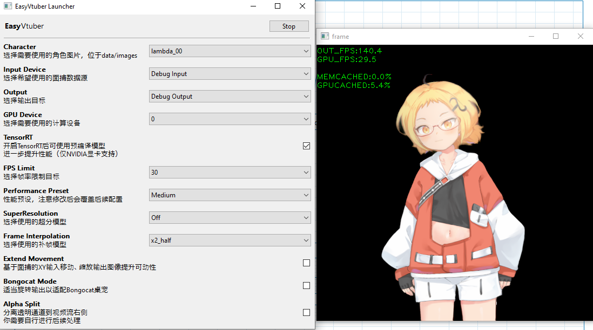

# EasyVtuber  

> 用买皮的钱，再买一张~~3080~~随便哪张显卡吧！


Fork自 https://github.com/GunwooHan/EasyVtuber  
为解决面捕质量问题，又反向port了原版demo https://github.com/pkhungurn/talking-head-anime-2-demo 中关于ifacialmocap的ios面捕逻辑  
并且省略了ifacialmocap pc端，通过UDP直连的方式使ios面捕刷新率达到最高60fps，解决了面捕刷新率的瓶颈  
最后，给EasyVtuber中使用的OBS虚拟摄像头方案增加配套的Shader支持，解锁RGBA输出能力，无需绿背即可直接使用

[视频介绍和安装说明](https://www.bilibili.com/video/BV1uu411r7DR)  

Updates:  
* 使用 https://github.com/zpeng11/ezvtuber-rt/tree/main 项目转换的ONNX模型，实现TensorRT加速以及非N卡支持，在半精度和全精度下均有加速（具体取决于显卡）  
* 为A卡和I卡提供DirectML支持，人人都能玩。  
* 引入[RIFE](https://github.com/hzwer/ECCV2022-RIFE)模型进行插帧，极限帧数提升达到50%-100%，配合锁帧可以有效降低使用占用。  
* 使用 [TurboJPEG](https://github.com/Dobatymo/turbojpeg-python) 获得成倍缓存命中率提升，在长时间使用上显卡减负效果相当出色。  
* 使用 [waifu2x](https://github.com/nagadomi/waifu2x) 和 [real-esrgan]() 项目带来的输出超分辨率，对比anime4k效果提升显著（也使用更多gpu占用）  
* 更漂亮的 WxPython 新启动器界面，带中文介绍更加简单易用  

## Requirements  

### 硬件  

- 支持FaceID的iPhone（使用ifacialmocap软件，需购买，需要稳定的WIFI连接）或网络摄像头（使用OpenCV）  
- 任意5年内的游戏级显卡，N卡/A卡/I卡均可使用
### 软件

- 本方案在Windows 10上测试可用
- Python>=3.8
- OBS或Unity Capture（虚拟摄像头方案）
- Photoshop或其他图片处理软件
- 科学上网方案，看懂英文网站和报错的能力

## 整合包版本
请使用合适方式下载整合包并自行解压：
* [夸克网盘](https://pan.quark.cn/s/b61ad5315f59)  
* 磁力链接 magnet:?xt=urn:btih:31ea4e070603b02a2ffd38418116b08b74551722
* [谷歌网盘](https://drive.google.com/drive/folders/1cYj18EfVQ2Cl348_rkCu_fgaasHTI_io?usp=drive_link)  
### 下载并安装CUDAToolkit
前往 [英伟达官网](https://developer.nvidia.com/cuda-downloads) 下载并安装`CUDATookit 12`及以上版本。 
若安装成功并重启可开启命令行工具验证出现类似如下结果：  
```
C:\Users\Eleven>nvidia-smi
Thu Jan  9 22:02:29 2025
+-----------------------------------------------------------------------------------------+
| NVIDIA-SMI 556.12                 Driver Version: 556.12         CUDA Version: 12.5     |
|-----------------------------------------+------------------------+----------------------+
| GPU  Name                  Driver-Model | Bus-Id          Disp.A | Volatile Uncorr. ECC |
| Fan  Temp   Perf          Pwr:Usage/Cap |           Memory-Usage | GPU-Util  Compute M. |
|                                         |                        |               MIG M. |
|=========================================+========================+======================|
|   0  NVIDIA GeForce GTX 1660 ...  WDDM  |   00000000:01:00.0  On |                  N/A |
| 32%   34C    P8             10W /  125W |     569MiB /   6144MiB |      1%      Default |
|                                         |                        |                  N/A |
+-----------------------------------------+------------------------+----------------------+
........
```
或可以双击 `00.检查安装CudaToolkits.bat` 来验证

### 安装Spout2 OBS插件(可选)
安装整合包附带的 `OBS_Spout2_Plugin_Install_v1.8.exe`， 安装包来自 https://github.com/Off-World-Live/obs-spout2-plugin 项目，可以提供透明通道给OBS。

### 启动项目
双击`02A.启动器.bat` 或 `02B.启动器（调试输出）.bat` 启动器，首次启动将会花约5分钟安装pip资源， 若是英伟达用户将会开始TensorRT构建，额外需要>20min时间(取决于显卡)，结束后可以大幅提升运行速度，构建的开头和结束输出如下。  
```
Start testing if TensorRT works on this machine
  0%|                                                                                           | 0/38 [00:00<?, ?it/s][01/09/2025-22:36:52] [TRT] [I] [MemUsageChange] Init CUDA: CPU +89, GPU +0, now: CPU 6758, GPU 1009 (MiB)
[01/09/2025-22:36:57] [TRT] [I] [MemUsageChange] Init builder kernel library: CPU +1358, GPU +194, now: CPU 8423, GPU 1203 (MiB)
[01/09/2025-22:36:57] [TRT] [I] Loading ONNX file from path ./data/models\rife_512\x2\fp32.onnx...
[01/09/2025-22:36:57] [TRT] [I] Beginning ONNX file parsing
[01/09/2025-22:36:57] [TRT] [I] Completed parsing of ONNX file
[01/09/2025-22:36:57] [TRT] [I] Input number: 2
[01/09/2025-22:36:57] [TRT] [I] Output number: 2
[01/09/2025-22:36:57] [TRT] [I] Building an engine from file ./data/models\rife_512\x2\fp32.onnx; this may take a while...
....
....
....
[01/10/2025-21:16:53] [TRT] [I] [BlockAssignment] Started assigning block shifts. This will take 66 steps to complete.
[01/10/2025-21:16:53] [TRT] [I] [BlockAssignment] Algorithm ShiftNTopDown took 3.4012ms to assign 7 blocks to 66 nodes requiring 218136064 bytes.
[01/10/2025-21:16:53] [TRT] [I] Total Activation Memory: 218135552 bytes
[01/10/2025-21:16:53] [TRT] [I] Total Weights Memory: 2724242 bytes
[01/10/2025-21:16:53] [TRT] [I] Compiler backend is used during engine execution.
[01/10/2025-21:16:53] [TRT] [I] Engine generation completed in 160.706 seconds.
[01/10/2025-21:16:53] [TRT] [I] [MemUsageStats] Peak memory usage of TRT CPU/GPU memory allocators: CPU 89 MiB, GPU 317 MiB
[01/10/2025-21:16:53] [TRT] [I] Completed creating Engine
[01/10/2025-21:16:53] [TRT] [I] Saving engine to file ./data/models\waifu2x_upconv\fp16\upconv_7\art\scale2x.trt
[01/10/2025-21:16:53] [TRT] [I] Completed saving engine
100%|██████████████████████████████████████████████████████████████████████████████████| 38/38 [46:54<00:00, 74.07s/it]
```
结束所有准备工作将进入启动器，如下图启动：
   
之后请移步输入输出自行调节。

## Installation(科学上网且使用Git)  
可使用此安装方法对本项目二次开发

### 安装CudaToolkits
同整合包版本

### 安装Anaconda（可选）
前往https://www.anaconda.com/ 安装Anaconda 并保证加入环境变量命令行可以找到，如：
```
C:\Users\Eleven>conda --version
conda 24.11.3
```
以上方式可以保证conda环境被你选定的Ananconda统一管理。若没有此需求可以忽略直接运行下一步，脚本会自动安装miniconda。

### 克隆项目和子项目
```
git clone https://github.com/zpeng11/EasyVtuber.git
cd EasyVtuber
git submodule init
git submodule update --recursive --remote
```

### 安装环境
双击运行`01A.构建运行环境（默认源）.bat`或者`01B.构建运行环境（国内源）.bat`   
这两个脚本会构建名为`ezvtb_rt_venv`的conda环境  
或可以用如下命令手动创建：   
```
conda create -y -n ezvtb_rt_venv python=3.10
conda activate ezvtb_rt_venv
conda install -y conda-forge::pycuda
python -m pip install --upgrade pip wheel
python -m pip install nvidia-cudnn-cu12
pip install tensorrt_cu12_libs==10.6.0 tensorrt_cu12_bindings==10.6.0 tensorrt==10.6.0 --extra-index-url https://pypi.nvidia.com
python -m pip install -r requirements.txt --no-warn-script-location
```

### 下载模型
前往模型 release 地址 https://github.com/zpeng11/ezvtuber-rt/releases/tag/0.0.1   
下载 https://github.com/zpeng11/ezvtuber-rt/releases/download/0.0.1/20241220.zip 并解压到`data/models`文件夹下

### Pycharm 配置
安装完成后，在Pycharm内打开本项目，右下角解释器菜单点开，`Add Interpreter...`->`Conda Environment`->`Existing environment`  
选好自己电脑上的`conda.exe`和刚才创建好的`ezvtb_rt_venv`环境内的`python.exe`    
点击OK，依赖全亮即可  

### 检查环境模型，并构建TensorRT  
在Conda环境中执行以下命令  
`python ezvtb_rt_interface.py`  

### 运行启动器  
在Conda环境中执行以下命令  
`python launcher.py`  

### 错误排查
当运行TensorRT构建或启动器出现错误时，请参考如下可能性：
1. 环境安装有错误（一般运行时缺少库99%的原因都是这个，pip下载并不稳定，各种网络问题都可能导致安装失败），检查源，手动删除`envs`文件夹再试, 对照 [此log](assets/complete_building_log.txt) 为成功案例排查原因。 实在不懂排查请使用整合包。
2. nvcc编译器没找到，即CudaToolkit安装有误，双击 `00.检查安装CudaToolkits.bat` 来验证
3. 英伟达显卡但计算架构低于7.5（10系以及之前）不支持TensorRT

## 输入输出设备  
#### SPOUT2 OBS插件输出
目前推荐这个方案，使用透明通道效果最好也最方便。使用前请移步 https://github.com/Off-World-Live/obs-spout2-plugin/releases  安装obs插件，并在obs中选择spout输入设备。

#### OBS Virtual Camera

UnityCapture存在未查明的性能瓶颈  
如果你选择自己进行抠像你可以直接输出到obs，如果你需要RGBA支持则需要额外使用一个Shader  
下载并安装StreamFX https://github.com/Xaymar/obs-StreamFX  
下载Shader（感谢树根的协助） https://github.com/shugen002/shader/blob/master/merge%20alpha2.hlsl  
之后，使用`--alpha_split`参数运行
  
你会看到这样的输出画面，透明通道单独使用灰度方式发送了  
之后对OBS中的视频采集设备添加滤镜-着色器-选择你下载的`merge alpha2.hlsl`-关闭   
这样透明通道就应用回左边的图像了  
你可能需要手动调整一下裁剪把右侧的无用画面切掉  
(看不到着色器滤镜的话就是StreamFX没装好或者OBS不是最新版)

#### UnityCapture  

如果需要使用透明通道输出，参考 https://github.com/schellingb/UnityCapture#installation 安装好UnityCapture  
只需要正常走完Install.bat，在OBS里能看到对应的设备（Unity Video Capture）就行  

在OBS添加完摄像头以后，还需要手动配置一次摄像头属性才能支持ARGB    
右键属性-取消激活-分辨率类型自定义-分辨率512x512(与`--output_size`参数一致)-视频格式ARGB-激活

#### iFacialMocap  

https://www.ifacialmocap.com/download/  
你大概率需要购买正式版（非广告，只是试用版不太够时长）  
购买之前确认好自己的设备支持  
**不需要下载PC软件**，装好iOS端的软件即可，连接信息通过参数传入Python  

#### OpenSeeFace  

https://github.com/emilianavt/OpenSeeFace/releases  
直接下载最新版本的Release包并解压  
之后进入解压目录的Binary文件夹  
右键编辑`run.bat`，在倒数第二行运行facetracker的命令后加上`--model 4`，切换到模型4可以wink  
`facetracker -c %cameraNum% -F %fps% -D %dcaps% -v 3 -P 1 --discard-after 0 --scan-every 0 --no-3d-adapt 1 --max-feature-updates 900 --model 4`（仅供参考）  
之后保存并双击`run.bat`运行，按照提示选择摄像头、分辨率、帧率，捕获正常的话可以看到输出画面  
最后在启动器中选择OpenSeeFace输入，或添加启动参数`--osf 127.0.0.1:11573`即可接入OpenSeeFace

## Run

`main.py` 的完全体运行命令请参考 `02B.启动器（调试输出）.bat` 的输出以及 `args.py`。 以下为部分基础参数

参数名 | 值类型 | 说明
:---: | :---: | :---:
--character|字符串|`character`目录下的输入图像文件名，不需要带扩展名
--debug|无|打开OpenCV预览窗口输出渲染结果，如果没有任何输出配置，该参数默认生效
--input|字符串|不使用iOS面捕时，传入要使用的摄像头设备名称，默认为设备0，有ifm参数时无效
--ifm|字符串|使用iOS面捕时，传入设备的`IP:端口号`，如`192.168.31.182:49983`
--output_webcam|字符串|可用值为`obs` `unitycapture`，选择对应的输出种类，不传不输出到摄像头
--extend_movement|浮点数|使用iOS面捕返回的头部位置，对模型输出图像进一步进行移动和旋转使得上半身可动<br>传入的数值表示移动倍率（建议值为1）
--output_size|字符串|格式为`256x256`，必须是4的倍数。<br>增大它并不会让图像更清晰，但配合extend_movement会增大可动范围
